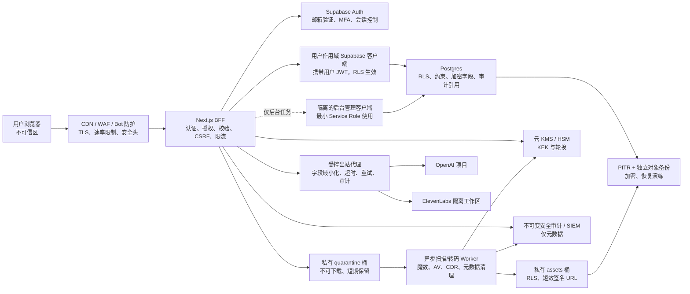
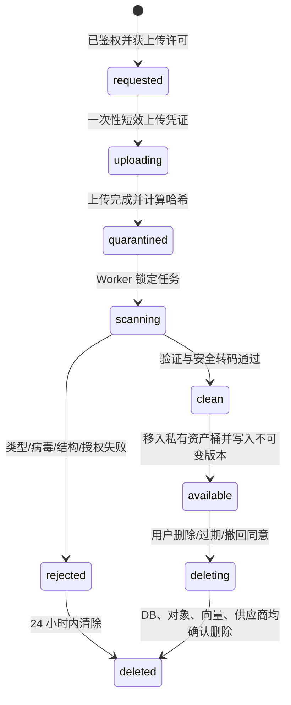

# 「记得」产品安全体系架构

> 版本：1.0  
> 日期：2026-07-15  
> 状态：目标架构与实施基线  
> 适用范围：Web 应用、Next.js API、Supabase Auth/Postgres/Storage、OpenAI、ElevenLabs、后台任务、运维与数据生命周期

## 0. 安全承诺边界

任何系统都不能承诺“绝对不会发生安全事件”。本架构的目标是：

1. 默认拒绝访问，只有经身份、资源归属和数据库策略三重确认后才能处理数据。
2. 即使单层代码出现错误，也由 RLS、私有存储、最小权限和审计等其他层阻止或发现越权。
3. 最大限度减少采集、保存、解密和传给第三方的数据。
4. 在账号失陷、密钥泄露、恶意上传、数据库误删或供应商异常时，具备限制影响、追溯、恢复和删除的能力。
5. 以 OWASP ASVS Level 2 为发布基线；声音克隆、批量导出、账号删除和管理员功能采用 Level 3 强度的控制。

本文件是工程设计，不替代中国大陆及目标市场的正式法律意见。上线前应对敏感个人信息、声音克隆、逝者人格权益和个人信息跨境传输完成专项法律评估。

## 1. 核心安全决策

| 编号 | 决策 | 不可违反的规则 |
|---|---|---|
| D-01 | 浏览器是不可信环境 | 浏览器永远不能持有 Service Role、OpenAI、ElevenLabs、KMS 或数据库管理密钥 |
| D-02 | 采用 BFF 安全边界 | 敏感数据操作统一进入 Next.js API/BFF；浏览器不再直接写核心业务表 |
| D-03 | 双重租户隔离 | BFF 验证用户与资源归属，同时数据库使用用户 JWT 执行 RLS；普通业务请求不得用 Service Role 绕过 RLS |
| D-04 | 上传先隔离后使用 | 文件先进入私有 `quarantine` 桶；类型识别、恶意软件扫描和安全转码通过后才能进入 `private-assets` |
| D-05 | 高敏内容再加密 | 数据库/磁盘加密之外，对声音样本、材料正文、聊天内容和导出包使用 KMS 信封加密 |
| D-06 | 第三方最小披露 | 每次调用只发送完成任务所需片段；默认不发送整份档案；供应商调用必须经过单独同意与跨境评估 |
| D-07 | 可验证删除 | 删除必须覆盖数据库、Storage、向量、缓存、供应商资源和后续备份到期，并保存不含内容的删除回执 |
| D-08 | 高风险动作强认证 | 声音克隆、批量导出、修改邮箱/密码、删除账号、创建共享链接须达到 MFA `aal2` 并重新认证 |
| D-09 | 日志不记录内容 | 不记录 JWT、密钥、原始文件、提示词、聊天正文、声音内容或完整邮箱；安全事件使用不可变元数据审计 |
| D-10 | 环境完全隔离 | 开发、测试、预发布、生产使用不同 Supabase 项目、Storage、供应商项目和密钥，不复制真实数据到非生产环境 |

## 2. 数据分类与处理规则

| 等级 | 示例 | 存储要求 | 出境/第三方 | 日志规则 |
|---|---|---|---|---|
| C0 公开 | 产品说明、公开政策 | 常规完整性保护 | 可按需 | 可记录 |
| C1 内部 | 配置版本、非敏感指标 | 访问控制、备份 | 原则上不需要 | 可记录非敏感元数据 |
| C2 个人信息 | 邮箱、姓名、关系、出生日期 | 私有、RLS、最小化、生命周期管理 | 需告知处理者与目的 | 脱敏或哈希 |
| C3 敏感/高度私密 | 声音样本、可能形成声纹的数据、私人材料、聊天、照片、视频、推断出的关系与经历、向量 | 私有存储、RLS、KMS 信封加密、MFA 高风险操作、严格导出 | 单独同意、必要性评估、处理者协议、可撤回 | 禁止记录内容 |
| C4 密钥与安全凭据 | Service Role、供应商 API Key、KMS Key、刷新令牌 | 专用密钥系统，禁止进入业务库和源码 | 禁止 | 禁止记录，连哈希也不记录 |

补充规则：

- 上传者可能提交其他在世自然人的资料，因此“用户上传”不等于“用户有权处理”。
- 声音克隆前必须保存上传者权利声明；在世声音主体需单独同意并完成平台要求的验证。
- 未成年人声音克隆默认禁止；其他未成年人信息启用监护人流程并采用更严格保留期限。
- `voice_id`、对象路径、签名 URL 和向量虽不一定直接可读，也按 C3 处理。
- 向量可能泄露原文语义，不得视为匿名数据。

## 3. 目标架构与信任边界



### 3.1 信任边界

1. **公网边界**：浏览器到 CDN/WAF，只接受 HTTPS。
2. **应用边界**：所有敏感业务进入 BFF；统一验证身份、MFA 等级、CSRF、速率、输入和资源归属。
3. **数据边界**：数据库 RLS 和 Storage RLS 是独立授权层，不能只依赖前端隐藏或 API 查询条件。
4. **高权限边界**：Service Role 只能存在于隔离后台任务，普通 API 不得导入管理客户端。
5. **文件边界**：隔离区文件永远不能被用户直接读取或送入解析/AI；只有扫描通过的不可变版本可使用。
6. **供应商边界**：OpenAI、ElevenLabs 是外部处理者；发送即视为数据离开本系统信任域。
7. **运维边界**：生产管理权限与开发权限分离，所有高权限操作强制 MFA 并审计。

## 4. 现状差距与风险优先级

| 风险 | 当前证据 | 级别 | 目标措施 |
|---|---|---:|---|
| 普通 API 使用 Service Role | `src/lib/server-supabase.ts` | 严重 | 建立每请求用户作用域客户端，让 RLS 始终生效；单独创建后台管理模块 |
| 浏览器直接访问核心表 | Dashboard、创建资料、材料、聊天页面直接使用 `supabase` | 高 | 迁移到 BFF；浏览器只保留认证和短效上传能力 |
| 声音以 base64 JSON 直接送第三方 | `voice-clone.ts` | 严重 | 改为私有隔离上传、扫描、授权校验、异步任务、使用后删除原始样本 |
| `consents` 只建表未强制执行 | `supabase/schema.sql` | 严重 | 供应商调用前在数据库事务中验证有效、版本化的单独同意 |
| 文件表与 Storage 未形成完整链路 | `uploaded_files` 无 Storage 策略和扫描状态 | 高 | 引入上传会话、对象状态机、Storage RLS 和扫描 Worker |
| 缺少应用级速率限制/额度 | API 只有输入大小限制 | 高 | 用户、IP、设备和资源四维限流，昂贵接口另设日额度 |
| 缺少安全审计 | 目前主要使用 `console.error` | 高 | 建立仅元数据、追加写、可告警的 `security_audit_events` |
| 删除不覆盖供应商与对象存储 | 数据库级联只能删除表记录 | 严重 | 删除编排任务、供应商删除 API、对象删除、向量/缓存删除、重试和回执 |
| RLS 仅存在于 SQL 文件，缺少部署验真测试 | 无迁移版本和 RLS 自动测试 | 高 | 版本化迁移；每表/每角色正反向授权测试；生产 Security Advisor 检查 |
| 消息角色可由浏览器直接写入 | 当前 RLS 只校验资料归属 | 高 | 用户只能创建 `role=user`；`assistant/system` 只允许受控服务写入 |
| CSP 仍允许内联脚本与样式 | 已部署 CSP、HSTS、frame-ancestors、nosniff、Referrer-Policy 和 Permissions-Policy；生产禁用 `unsafe-eval` | 中 | 后续迁移到 nonce/hash CSP，逐步移除 `unsafe-inline` |
| 内部测试工具被误发布 | `/api/assessment`、`/self-test`、`/test-chat`、`/test-eval` 已在生产返回 404 | 低 | 保持自动门禁；未来如需预发布使用，改为管理员强认证而非公开开关 |
| 供应商保留和跨境风险未闭环 | OpenAI/ElevenLabs 调用无同意门 | 严重 | PIPIA/DPIA、DPA、区域评估、ZDR/最短保留、退出与删除流程 |

在上述“严重”项完成前，不应向公众开放真实文件上传和声音克隆。

## 5. 身份、会话与访问控制

### 5.1 身份认证

- 注册必须验证邮箱；登录、注册、找回密码启用 Cloudflare Turnstile 或 hCaptcha。
- 禁止常见泄露密码，最低 12 位；不要求无事件的周期性强制改密。
- 普通访问允许 `aal1`；声音克隆、导出、账号删除、授权共享和管理员入口要求 `aal2`。
- 高风险动作要求最近 10 分钟内重新认证；不能只判断“当前已登录”。
- 管理员使用独立身份组、硬件安全密钥/通行密钥和独立管理入口，普通用户身份不能提升为后台账号。
- 账号找回不得绕过 MFA；MFA 恢复码只显示一次并以不可逆形式保存。

### 5.2 会话策略

建议初始配置：

- Access Token：1 小时；不低于 5 分钟。
- 刷新令牌轮换与复用检测保持开启。
- 普通账号：最长会话 30 天、无活动 7 天失效。
- 管理员：最长 8 小时、无活动 30 分钟失效。
- 密码、邮箱、MFA 或风险状态变化时撤销全部会话。
- 页面不得把令牌放入 URL、错误信息、分析工具或日志。

当前是富客户端应用。最终有两种可接受方式：

1. **首选 BFF 会话**：敏感业务全部经服务器，刷新令牌放入 `Secure; HttpOnly; SameSite=Lax/Strict` Cookie；写请求使用 CSRF Token 与 Origin 校验。
2. **保留浏览器 Supabase 会话**：仅用于 RLS 直接访问时使用；必须使用严格 CSP、依赖治理和 XSS 测试，因为 JavaScript 可访问的令牌会扩大 XSS 后果。

### 5.3 三层授权

每次请求都必须通过：

1. **操作权限**：该用户是否允许执行此动作，以及是否满足 MFA/重新认证。
2. **资源权限**：`profile_id` 是否属于当前用户或其明确的协作 ACL。
3. **数据策略**：Postgres/Storage RLS 是否再次允许相同行为。

不得信任请求体内的 `userId`、对象路径、角色、`voice_id`、加密 key id 或供应商资源 id。

### 5.4 未来协作模式

如果未来允许家庭成员共享，禁止简单地新增 `is_public`。应增加：

- `profile_members(profile_id, user_id, role, invited_by, accepted_at, revoked_at)`；
- 角色仅允许 `owner/editor/viewer`；
- 邀请使用一次性、短时、哈希存储的 token；
- 所有 RLS 从成员表判断权限；
- 声音克隆、删除和导出始终仅限 owner + `aal2`。

## 6. 数据库安全架构

### 6.1 客户端分离

应建立两个完全分离的模块：

- `user-supabase.ts`：使用 Publishable/Anon Key，并将当前用户 JWT 放入 Authorization Header。所有普通 CRUD 走它，让 RLS 生效。
- `admin-supabase.ts`：使用 Service Role，仅供队列 Worker、删除编排和受审计运维任务。普通 API 的导入规则应由 ESLint/CI 禁止。

普通请求即使已经在 BFF 验证归属，也必须使用用户作用域客户端，形成纵深防御。

### 6.2 Schema 与权限分层

- `public`：只放必须经 PostgREST 暴露的表/视图，所有表启用 RLS。
- `private`：密钥引用、删除任务、供应商映射、加密元数据，不向 `anon/authenticated` 授权。
- `audit`：追加写安全审计；业务角色不可更新或删除。
- 显式撤销默认权限；只向 `authenticated` 授予确实需要的表和动作。
- RLS policy 显式写 `TO authenticated`，同时包含 `USING` 和 `WITH CHECK`。
- 所有外键列建索引；权限策略中的 `auth.uid()` 使用 `(select auth.uid())` 形式降低重复计算。
- 对高价值表考虑 `FORCE ROW LEVEL SECURITY`，并确保迁移/测试角色不意外绕过。

### 6.3 租户一致性

建议所有高频业务表冗余不可变的 `user_id`，并通过复合外键保证：

```sql
unique (id, user_id)
foreign key (memory_profile_id, user_id)
  references memory_profiles(id, user_id)
```

这样数据库可直接拒绝把 A 用户的消息、材料或文件挂到 B 用户资料下。`user_id` 只能在插入时由 `auth.uid()` 或受控函数写入，之后不可修改。

### 6.4 行级安全基线

每张表必须有自动化测试验证：

- 匿名角色无法读取或修改任何 C2/C3 数据；
- 用户 A 无法通过 UUID 猜测读取、更新、删除用户 B 的任意记录；
- 用户不能修改所有权字段；
- 用户只能插入 `messages.role = 'user'`；
- 用户不能直接写向量、供应商 id、扫描状态、审计事件和后台任务完成状态；
- Storage 对象路径中的 user id 必须等于 JWT `sub`，且 profile 确实属于该用户；
- Service Role 的每个使用点都有静态白名单和审计事件。

### 6.5 数据加密

1. **传输中**：全站 TLS；Supabase 数据库开启 SSL Enforcement，运维直连使用 `sslmode=verify-full`。
2. **静态存储**：使用 Supabase 托管磁盘加密作为第一层。
3. **字段/对象级**：C3 内容使用 AES-256-GCM 信封加密：
   - 每个用户或资料生成独立 DEK；
   - DEK 由云 KMS 中的 KEK 加密；
   - 数据库存 `ciphertext`、`nonce`、`key_version` 和加密后的 DEK，不存明文密钥；
   - 解密只发生在短生命周期 Worker 内存中；
   - 轮换 KEK 不必重加密所有内容，销毁 DEK 可执行加密擦除。
4. 搜索、RAG 和向量生成在受控 Worker 中解密最小片段；向量本身继续按 C3 保护。

不要使用可逆“自制加密”、固定 IV、把密钥与密文放在同一业务表，或依赖哈希来保护需要恢复的内容。

### 6.6 完整性与迁移

- 使用版本化、事务化迁移，不再把 `schema.sql` 当成唯一部署记录。
- 迁移可重复执行或明确记录版本；策略、触发器和扩展必须有部署前检查。
- 对日期、角色、状态、长度、文件大小和枚举建立数据库约束，不能只依赖 TypeScript。
- 生产禁止手工改表；紧急变更需双人批准、工单、备份点和审计。
- 每次发布运行 RLS 正反向测试、迁移 dry-run 和回滚验证。

## 7. 用户上传安全体系

### 7.1 文件状态机



### 7.2 上传流程

1. BFF 验证登录、资源归属、额度、有效同意和文件用途。
2. 服务端创建 `upload_sessions`，生成随机对象名和 5 分钟内有效的一次性上传凭证。
3. 客户端直传私有 `quarantine` 桶，路径固定为 `user_uuid/profile_uuid/random_uuid`，不使用原始文件名。
4. 上传完成后 Worker 读取对象并执行：
   - 扩展名白名单；
   - 声明 MIME、文件魔数和真实解析结果三方一致；
   - 文件大小、像素、时长、采样率、页数、解压后大小和压缩比限制；
   - 恶意软件扫描；
   - 文档主动内容/CDR 检查；
   - 图片 EXIF/GPS 清除并安全重编码；
   - 音视频用受限解码器重新封装/转码；
   - SHA-256 去重与已知恶意样本阻断。
5. 扫描通过后复制为不可变对象版本到私有资产桶，写入扫描器版本和哈希；隔离原件删除。
6. 下载使用用户 JWT 或 60–300 秒签名 URL。C3 导出优先经 BFF 流式代理，响应设置 `Content-Disposition: attachment`、`X-Content-Type-Options: nosniff`。

### 7.3 文件策略

- 默认只允许业务明确需要的图片、音频、视频和文档类型；初期禁止压缩包、可执行文件、SVG、HTML 和带宏 Office 文档。
- 不信任客户端 MIME、扩展名、文件名和 EXIF。
- 不在数据库存 base64 文件，不把上传内容写入日志，不把隔离对象公开给 CDN。
- 每用户、每资料和全局分别限制并发数、单文件大小、每日流量和总容量。
- 扫描失败、超时或扫描服务不可用时一律 fail closed，不得自动放行。
- 解析器和转码器在无出站网络、只读根文件系统、低权限、CPU/内存/时间受限的沙箱中运行。
- Storage 数据不包含在 Supabase 数据库备份中，必须单独备份并演练恢复。

### 7.4 声音样本额外要求

- 上传前展示单独的声音处理告知和跨境告知，保存 consent 文本版本、哈希、时间、主体/上传者关系和撤回状态。
- 保存上传者对声音的合法权利声明；高风险场景进行人工审核或声音主体验证。
- 原始样本只在隔离桶短期存在；供应商确认克隆后建议 24 小时内删除，最长不得超过经评估批准的期限。
- 声音模型仅供该资料 owner 使用，禁止出现在公共 Voice Library。
- 删除资料、撤回声音同意或封禁账号时，必须调用供应商删除 voice model，并验证删除结果。
- 声音克隆任务异步化、幂等化；不再使用当前 base64 JSON 直传模式。

## 8. AI、RAG 与第三方处理安全

### 8.1 数据最小化

当前聊天接口会把资料描述和最多 10 条材料直接拼接给模型。目标流程应改为：

1. 先在本系统内做用户作用域检索；所有向量查询必须同时过滤 `user_id` 和 `profile_id`。
2. 只取回答所需的少量片段，去掉邮箱、电话、地址、证件号等无关信息。
3. 为外发内容生成 `disclosure_event`，记录片段 id、供应商、目的、同意版本和请求 id，不记录正文。
4. 设置供应商请求超时、最大 token、最大并发和成本上限；失败不把供应商原始错误返回客户端。
5. 禁止供应商响应直接决定数据库权限、执行 SQL、删除数据或调用高权限工具。

### 8.2 提示词注入与内容边界

- 上传材料和检索片段永远标记为“不可信数据”，不能成为系统指令。
- 系统提示、用户输入、检索内容使用结构化字段或清晰分隔，不用字符串无边界拼接。
- 若未来启用工具调用，工具层必须重新认证和授权；模型输出不能当作授权证明。
- 对输出做长度、内容类型和安全策略检查；前端按纯文本渲染，不使用不受控 `dangerouslySetInnerHTML`。
- 防止跨资料检索、缓存串租户、调试日志泄露和错误追踪平台采集提示词。
- 需要对情感依赖、自伤风险、冒充真实逝者等产品安全问题建立独立内容与升级策略。

### 8.3 OpenAI 控制

- API 数据默认不用于训练，但默认滥用监控日志可能保留最多 30 天；如果业务敏感度要求更高，应申请 Modified Abuse Monitoring 或 Zero Data Retention。
- 使用独立生产 Project 和最小额度 Key；不与开发环境共享。
- 请求显式禁止存储（适用端点使用 `store: false`），不使用会长期保存状态的功能，除非另行评估。
- 在隐私告知中列明发送的数据类别、目的、可能区域、默认保留与用户权利。

### 8.4 ElevenLabs 控制

- 官方政策明确声音数据可能构成生物识别数据，且标准服务存在保留和模型改进处理；必须将其视为独立的高风险处理者。
- 企业 Zero Retention 对 TTS 可用，但官方当前说明 Instant/Professional Voice Cloning 的音频样本不支持 Zero Retention；不能把 ZRM 当作声音克隆样本立即删除的保证。
- 上线前签署适用的 DPA，确认工作区数据驻留、子处理者、训练退出、删除 API、事件通知和审计权。
- 如果无法获得满足目标地区要求的合同、数据驻留和删除保证，应关闭声音克隆，而不是降低本系统控制。

## 9. 隐私、同意与数据生命周期

### 9.1 同意模型

同意必须是可证明、可撤回、按目的拆分的，不得用一个总开关覆盖所有处理：

| 同意类型 | 触发点 | 是否单独同意 | 撤回结果 |
|---|---|---:|---|
| 隐私政策/基础服务 | 注册 | 是 | 进入账号删除或停止非必要处理 |
| 记忆材料处理 | 首次创建/上传 | 是 | 停止新处理，可导出或删除 |
| AI 第三方处理与跨境 | 首次 AI 对话前 | 是 | 禁止后续模型调用，保留本地资料按用户选择处理 |
| 声音克隆/生物识别 | 每个声音主体、每个资料 | 必须单独 | 禁止 TTS，删除样本与供应商 voice model |
| 模型改进/研究 | 独立 opt-in | 是，默认关闭 | 停止后续使用，不影响基础服务 |
| 家庭成员共享 | 每次邀请/权限变更 | 是 | 立即撤销 ACL 与未过期共享链接 |

`consents` 应保存：主体、资料、目的、政策版本、展示文本哈希、同意/撤回时间、采集界面版本、地区、证明材料引用和过期时间。不得只保存一个布尔值。

### 9.2 个人信息保护影响评估

以下处理上线前必须完成并留存 PIPIA/DPIA：

- 敏感个人信息/声音数据；
- 向 OpenAI、ElevenLabs 等处理者提供数据；
- 个人信息跨境；
- 大规模自动化推断或对个人权益有重大影响的功能；
- 新增共享、公开纪念页或人脸/声纹识别。

评估至少包含目的与必要性、数据流、主体权益影响、供应商和区域、威胁、控制有效性、残余风险、批准人和复审日期。
评估报告与处理记录至少保存 3 年，并在处理目的、数据类别、供应商、区域或风险显著变化时重新评估。

### 9.3 建议保留期限

以下是工程默认值，须由产品与法务最终批准：

| 数据 | 默认期限 | 删除机制 |
|---|---:|---|
| 被拒绝/失败的隔离文件 | 最长 24 小时 | 自动清理任务 |
| 声音原始样本 | 克隆成功后 24 小时，失败后 24 小时 | Storage 删除并校验对象不存在 |
| 正式记忆材料 | 用户保留期间 | 用户删除、账号删除或到期策略 |
| 聊天记录 | 默认 365 天，可由用户缩短或关闭保存 | 分区过期任务 + 用户即时删除 |
| 向量/派生内容 | 不得长于来源 | 来源删除事务触发删除任务 |
| 短效签名 URL | 60–300 秒 | 到期；高敏内容不依赖可撤销性差的长签名 URL |
| 安全审计元数据 | 365 天 | 分区删除；重大事件按法务保留 |
| 应用错误日志 | 30 天 | 集中日志生命周期 |
| 数据库 PITR/备份 | 7–35 天，按风险与预算 | 到期自动清除并记录 |
| 删除回执（无内容） | 3 年或法务批准期限 | 到期清理 |

### 9.4 可验证删除编排

用户删除资料或账号后创建幂等 `deletion_job`：

1. 立即冻结访问并撤销分享/签名 URL 发放；
2. 删除数据库正文、消息、材料、向量、任务和授权；
3. 删除 Storage 正式对象、隔离对象和导出包；
4. 调用 OpenAI（如存在持久对象）和 ElevenLabs 删除外部资源；
5. 清理缓存、搜索索引和分析系统中的用户标识；
6. 对失败步骤指数退避重试并告警；
7. 生成不含内容的删除回执；
8. 告知用户活动系统删除完成，以及备份将在最迟日期自然到期。

数据库 `ON DELETE CASCADE` 不能替代上述跨系统流程。

## 10. 密钥、基础设施与网络安全

### 10.1 密钥治理

- 生产密钥进入部署平台 Secret Manager 或云 KMS；`.env.local` 仅用于本地开发。
- 每个环境、供应商和用途使用独立 Key；设置最小额度、API 范围和来源限制。
- Service Role 只在隔离后台任务可见；面向公网的普通函数不得读取。
- 建议 90 天轮换供应商 Key；人员离职、日志误泄露、异常调用或供应链事件立即轮换。
- 轮换流程必须支持双 Key 过渡、回滚和审计，不允许在工单、聊天或截图中传播密钥。
- Git 提交前和 CI 使用 secret scanning；发现真实密钥时按“已泄露”处理，删除文件不等于撤销密钥。

### 10.2 边缘与应用控制

- 强制 HTTPS、HSTS（确认所有子域支持后启用 `includeSubDomains; preload`）。
- CSP 从 Report-Only 调整后强制执行，使用 nonce；至少限制 `default-src 'self'`、`object-src 'none'`、`base-uri 'none'`、`frame-ancestors 'none'`。
- 设置 `X-Content-Type-Options: nosniff`、严格 `Referrer-Policy`、最小 `Permissions-Policy`。
- CORS 使用明确生产域白名单，不允许携带凭据的 `*`。
- Cookie 使用 `Secure`、`HttpOnly`、适当 `SameSite`；所有 Cookie 设置明确 Path、Domain 和 Max-Age。
- API 使用统一 JSON 大小上限、超时、并发控制、幂等键和请求 id。
- WAF/Bot 规则覆盖凭据填充、扫描器、异常国家/ASN（按业务区域评估）和成本型 API 滥用。

### 10.3 初始限流建议

| 接口 | 用户维度 | IP/设备维度 | 额外控制 |
|---|---:|---:|---|
| 登录/注册/找回 | 采用 Supabase Auth 默认并调优 | CAPTCHA + 平台限流 | 失败聚合告警，不泄露账号是否存在 |
| `/api/chat` | 20 次/分钟、每日成本额度 | 60 次/分钟 | 单资料并发上限、供应商熔断 |
| `/api/voice-synthesize` | 10 次/分钟 | 30 次/分钟 | 字符日额度、缓存仅限同用户 |
| `/api/voice-clone` | 2 次/日 | 5 次/日 | `aal2`、同意、人工/自动反滥用审核 |
| 上传签名 | 20 次/小时 | 60 次/小时 | 总容量、并发数、用途绑定 |
| 导出/删除 | 3 次/小时 | 10 次/小时 | `aal2`、重新认证、幂等键 |

生产限值应根据真实流量调整，但任何昂贵或高风险接口都不能无限制。

### 10.4 网络与环境

- Supabase 开启数据库 SSL Enforcement；数据库直连只允许受控 CI/运维出口，能使用网络限制时启用。
- 应用出站只允许 Supabase、OpenAI、ElevenLabs、监控和批准的扫描服务域名。
- 预发布使用合成数据；禁止把生产数据库 dump 下载到开发电脑。
- 管理控制台启用组织 MFA、最小成员角色、季度权限复审和离职即时撤销。

## 11. 安全审计、监控与告警

### 11.1 必须审计的事件

- 登录成功/失败、MFA 注册/删除/验证、找回密码、会话撤销；
- 授权失败、跨租户访问尝试、RLS 拒绝；
- 资料创建/删除、同意授予/撤回、共享权限变化；
- 上传申请、扫描结果、下载、导出、删除；
- 声音克隆、TTS、AI 第三方披露；
- Service Role 使用、密钥轮换、配置变化、迁移和管理员操作；
- 备份、恢复、删除任务和供应商删除失败。

事件字段：`event_id`、UTC 时间、请求 id、actor user id、session id、动作、资源类型和不可逆标识、结果、错误类别、MFA 等级、IP 前缀/哈希、User-Agent 哈希、供应商、政策版本。不得写入正文、令牌、密钥、原始文件名或完整 IP（除非经评估确有必要）。

### 11.2 日志保护

- 审计存储与业务数据库权限分离，应用只有追加权限；管理员删除日志需要双人批准。
- 日志传输和静态存储加密；使用追加写/WORM 或外部 SIEM 防止攻击者删痕。
- 错误追踪 SDK 在发送前清洗 Authorization、Cookie、请求体、查询参数和用户内容。
- 时间同步、统一 UTC、请求链路 id，确保跨系统可关联。

### 11.3 告警基线

- 同账号/同 IP 突发认证失败、异常设备或地区；
- 403/401、签名 URL、下载或导出异常增长；
- 任何跨租户测试命中、RLS/策略变化、Service Role 出现在公网函数；
- 文件扫描服务不可用或恶意文件命中；
- AI/语音成本、失败率或延迟突增；
- 删除任务超过 SLA、供应商删除失败；
- 密钥扫描命中、依赖严重漏洞、生产配置漂移；
- PITR/对象备份失败或恢复演练失败。

## 12. 备份、恢复与业务连续性

### 12.1 目标

- 初始 RPO：15 分钟以内；RTO：4 小时以内。正式 SLA 由业务确认。
- 生产启用 Supabase PITR；Free 计划不适合承载该类高敏生产数据。
- 每日生成加密逻辑备份到独立账号/区域，保留期限与跨境要求一致。
- Supabase 数据库备份不包含 Storage 对象，因此对象存储必须独立版本化/备份。
- KMS 密钥恢复材料与数据备份分离；没有密钥的备份不可恢复，有密钥无审批也不可解密。

### 12.2 恢复演练

- 每季度在隔离环境完成数据库 + Storage + KMS 的全链路恢复。
- 验证 RLS、用户归属、对象哈希、删除标记和供应商映射，而不只是“数据库能启动”。
- 记录实际 RPO/RTO、失败点、修复负责人和截止时间。
- 备份恢复不能复活已经完成删除的活跃数据；恢复后运行删除墓碑重放任务。

## 13. 安全开发生命周期

### 13.1 每次提交/发布门禁

- TypeScript、Lint、单元测试、API 鉴权测试；
- RLS/Storage policy 的用户 A/B/匿名/后台角色矩阵测试；
- 依赖漏洞、许可证、secret scanning、SAST；
- 数据库迁移 dry-run、约束测试、回滚演练；
- 安全头与 CSP 自动测试；
- 文件类型混淆、超大文件、压缩炸弹、恶意样本和解析器超时测试；
- Prompt injection、跨资料检索和缓存串租户测试；
- 删除编排和供应商失败注入测试。

严重/高危漏洞、RLS 反向测试失败、密钥命中或删除流程失败时禁止发布。当前 Next.js 内置 PostCSS 的中等级依赖风险应持续跟踪，不能采用会破坏框架的强制降级修复。

### 13.2 周期性活动

- 每季度权限、密钥、供应商和数据清单复审；
- 每季度恢复演练与桌面事件演练；
- 上线前及重大架构变更后进行独立渗透测试；至少每年复测；
- 每年或处理目的/供应商/区域变化时更新 PIPIA/DPIA；
- 使用 STRIDE 做安全威胁建模，使用 LINDDUN 做隐私威胁建模。

## 14. 安全事件响应

1. **准备**：联系人、供应商升级通道、证据保全、密钥轮换、用户通知和监管报告模板。
2. **发现与分级**：判断数据类型、用户数量、是否声音/生物识别、是否越权、是否仍在发生。
3. **遏制**：关闭功能开关、撤销会话/签名 URL、轮换密钥、冻结供应商项目、隔离恶意对象。
4. **根除**：修复根因、清除后门、验证 RLS/日志/依赖和供应商状态。
5. **恢复**：从可信备份恢复，逐步放量并加强监控。
6. **通知**：依据适用法律立即采取补救，并由法务判断对主管部门和个人的通知义务；不得自行套用其他法域的固定时限。
7. **复盘**：无责复盘、控制失效分析、行动项、负责人和截止时间；验证修复而非只更新文档。

## 15. 责任矩阵

| 控制域 | 产品/法务 | 应用团队 | 数据/平台 | 安全/运维 | 供应商 |
|---|---|---|---|---|---|
| 数据目的、同意、保留 | A/R | C | C | C | I |
| BFF 鉴权和输入校验 | C | A/R | C | C | I |
| RLS、约束、迁移 | I | C | A/R | C | I |
| Storage/扫描 Worker | C | R | R | A | C |
| KMS、密钥、网络 | I | C | R | A | C |
| 供应商 DPA/跨境 | A/R | C | I | C | R |
| 审计、告警、响应 | C | R | R | A | C |
| 删除与用户权利 | A | R | R | C | R |
| 备份与恢复 | I | C | R | A | C |

`A` 最终负责，`R` 执行，`C` 参与，`I` 知会。

## 16. 实施路线与发布闸门

### P0：公开上线前必须完成

1. 用 Feature Flag 暂停真实文件上传和声音克隆，直到以下控制完成。
2. 拆分用户作用域与后台管理 Supabase 客户端；普通业务 API 禁止 Service Role。
3. 将核心表的前端直连操作迁移到 BFF；建立统一鉴权、归属校验、错误格式和请求 id。
4. 把 SQL 转为版本化迁移，补齐 RLS、`WITH CHECK`、角色授权、复合外键与正反向测试。
5. 建立私有 quarantine/assets 桶、Storage RLS、短效上传凭证和基础扫描 Worker。
6. 实现版本化同意；AI、声音和跨境处理在调用前强制验证。
7. 实现应用限流、CAPTCHA、CSP/安全头、生产诊断接口关闭。
8. 轮换现有 Supabase/OpenAI/ElevenLabs 密钥，迁入生产 Secret Manager，并隔离环境。
9. 完成 OpenAI/ElevenLabs 数据处理与跨境评估；无法满足时保持相应功能关闭。
10. 建立最小安全审计、告警、PITR 和 Storage 独立备份。

### P1：受控 Beta 前完成

1. KMS 信封加密与密钥轮换；
2. 完整扫描/CDR/安全转码和上传沙箱；
3. 删除编排、导出、撤回同意、供应商删除和用户可见回执；
4. MFA 与高风险动作重新认证；
5. AI 数据最小化、PII 清洗、RAG 租户隔离和 Prompt injection 测试；
6. SIEM、异常检测、成本熔断、供应商故障演练；
7. 独立渗透测试和 PIPIA/DPIA 批准。

### P2：规模化运营前完成

1. 家庭协作 ACL、邀请和共享撤销；
2. 细粒度管理员权限、Just-in-Time 访问和双人审批；
3. 数据驻留/区域化、灾备环境和定期全链路恢复；
4. 自动数据发现、保留策略证明、控制证据归档；
5. ASVS Level 2 全量验收与高风险模块 Level 3 验收。

## 17. 验收指标

安全体系不以“已写文档”为完成，至少满足：

- 0 个浏览器可访问的 C4 密钥；
- 0 个普通 API 使用 Service Role；
- 100% 暴露表启用并测试 RLS；
- 用户 A/B 越权测试 100% 被数据库层拒绝；
- 100% 上传文件在可用前完成扫描；
- 100% AI/语音外发有有效同意和披露事件；
- 100% 删除任务覆盖 DB、Storage、向量和供应商，失败可重试并告警；
- 高风险动作 100% 要求 `aal2` 和近期认证；
- 日志抽检 0 个 JWT、密钥和用户正文；
- 每季度恢复演练满足 RPO/RTO；
- 严重/高危漏洞为 0 才允许发布。

## 18. 官方依据

- [Supabase Row Level Security](https://supabase.com/docs/guides/database/postgres/row-level-security)
- [Supabase 私有 Storage Bucket 与短效签名 URL](https://supabase.com/docs/guides/storage/buckets/fundamentals)
- [Supabase Storage Schema 与 RLS](https://supabase.com/docs/guides/storage/schema/design)
- [Supabase Auth MFA](https://supabase.com/docs/guides/auth/auth-mfa)
- [Supabase Auth Rate Limits](https://supabase.com/docs/guides/auth/rate-limits)
- [Supabase User Sessions](https://supabase.com/docs/guides/auth/sessions)
- [Supabase Postgres SSL Enforcement](https://supabase.com/docs/guides/platform/ssl-enforcement)
- [Supabase Database Backups / PITR](https://supabase.com/docs/guides/platform/backups)
- [OWASP File Upload Cheat Sheet](https://cheatsheetseries.owasp.org/cheatsheets/File_Upload_Cheat_Sheet.html)
- [OWASP Authentication Cheat Sheet](https://cheatsheetseries.owasp.org/cheatsheets/Authentication_Cheat_Sheet.html)
- [OWASP Logging Cheat Sheet](https://cheatsheetseries.owasp.org/cheatsheets/Logging_Cheat_Sheet.html)
- [OpenAI API Data Controls](https://platform.openai.com/docs/models/default-usage-policies-by-endpoint)
- [ElevenLabs Privacy Policy](https://elevenlabs.io/privacy-policy)
- [ElevenLabs Zero Retention Mode](https://elevenlabs.io/docs/eleven-api/resources/zero-retention-mode)
- [ElevenLabs Data Residency](https://elevenlabs.io/docs/overview/administration/data-residency)
- [中华人民共和国个人信息保护法](https://www.npc.gov.cn/npc/c2/c30834/202108/t20210820_313088.html)
